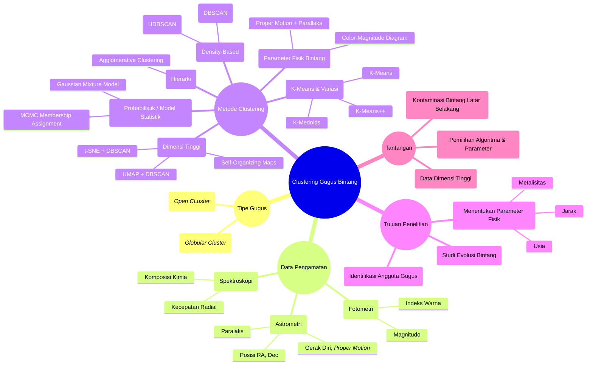
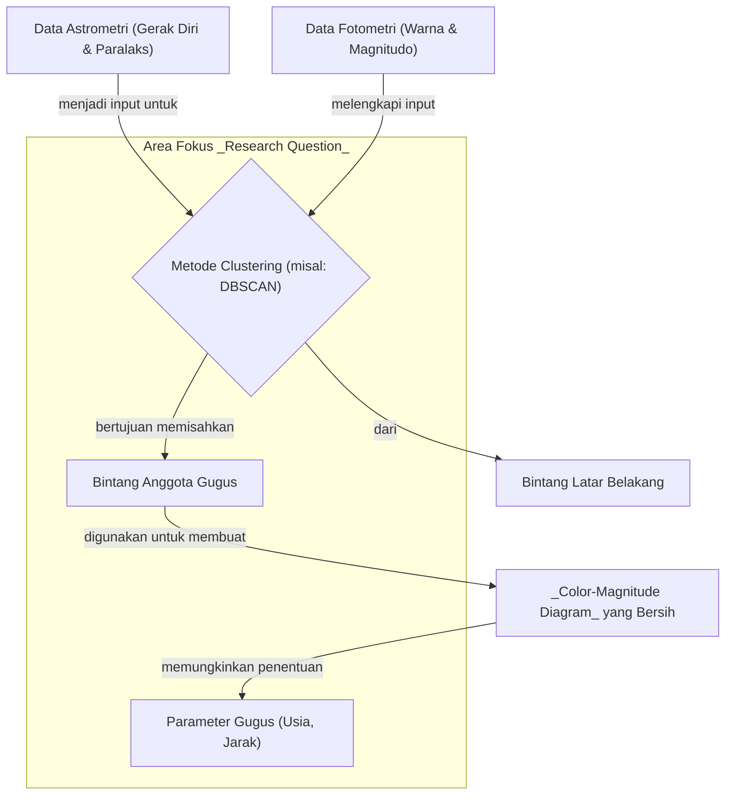

`author: Ulivia Embun (10322015)`
# TASK SLIDE 1 - Mind Map and Concept Map

Pembuatan Mind Map dan Concept Map untuk topik riset saya, yaitu tentang clustering gugus bintang. Dimana hal ini bertujuan untuk membantu mengembangkan ide penelitian terkait topik riset tersebut.
## 1. Mind Map
Mind map ini dibuat menggunakan sintaks `mermaid` untuk memvisualisasikan berbagai kemungkinan area riset. Memetakan ide seluruh komponen yang dibutuhkan. Mulai dari tipe gugus apa yang akan menjadi target, jenis data yang bisa digunakan, metode apa yang relevan, hingga tujuan akhir penelitian.

## 2. Concept Map

Dari ide-ide yang luas pada Mind Map di atas, beberapa _key concept_ dipilih untuk dianalisis hubungannya. Concept Map ini dibuat untuk memvisualisasikan alur kerja penelitian yang spesifik dan membantu merumuskan _research question_.

Concept Map ini mengklarifikasi hubungan sebab-akibat. Bagaimana data input diproses oleh sebuah metode untuk menghasilkan output berupa anggota gugus, yang kemudian digunakan untuk analisis lanjutan. Alur ini secara langsung mengarah pada perumusan pertanyaan berikut:

### Pertanyaan Penelitian yang dihasilkan:
1.  Seberapa efektif algoritma clustering berbasis kepadatan seperti DBSCAN dalam mengidentifikasi anggota gugus bintang terbuka (*open cluster*) dari data astrometri multi-dimensi (gerak diri dan paralaks)?
2.  Bagaimana perbandingan akurasi identifikasi anggota gugus antara metode yang hanya menggunakan data astrometri dengan metode yang mengkombinasikan data astrometri dan fotometri?
3.  Apakah penerapan metode clustering pada data survei seperti Gaia dapat meningkatkan akurasi penentuan parameter gugus (usia dan jarak) dibandingkan dengan metode tradisional?

---

## Jadi, apakah hasil dari _Mind Map_ dan _Concept Map_ sama?

Sesuai dengan apa yang dijelaskan pada slide kuliah, hasil dari penggunaan kedua _tools_ ini **berbeda tetapi saling melengkapi**.

* **Mind Map** menghasilkan **divergensi ide**. Dimana fungsinya memang untuk eksplorasi dan *brainstorming*. Memetakan semua kemungkinan tanpa terlalu fokus pada hubungan antar-elemen, sehingga hasilnya gambaran umum yang luas.
* **Concept Map** menghasilkan **konvergensi ide**. Dimana fungsinya untuk analisis lebih dalam dengan memaksa kita untuk mendefinisikan hubungan logis antar konsep, sehingga menyaring ide-ide luas menjadi sebuah kerangka kerja penelitian yang fokus dan terstruktur.

**Kesimpulannya**, penggunaan *Mind Map* untuk menemukan ide penelitian, sedangkan *concept map* untuk merumuskan pertanyaan penelitian. Keduanya merupakan dua langkah berbeda, tetapi jika digabungkan akan menjadi alur kerja yang sangat efektif untuk memulai sebuah proyek riset.
